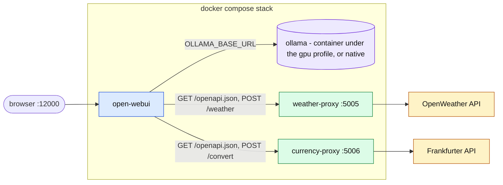
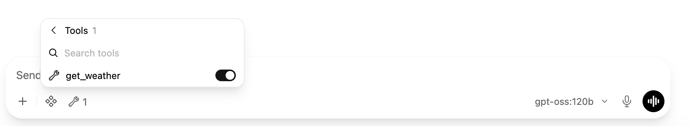

# open-webui-service-weather

A local [Open WebUI](https://github.com/open-webui/open-webui) instance with a small
weather service attached to it, so the chat model can answer questions like
*"What will the weather be this weekend in Princeton, NJ?"* with real forecast data
instead of declining.

The weather service is a Flask app that wraps [OpenWeather](https://openweathermap.org/).
It describes itself with an OpenAPI document, which Open WebUI registers as an
**external tool server** — that is the mechanism that makes `get_weather` available
to the model.

A second service, `currency-proxy`, does the same for
[Frankfurter](https://frankfurter.dev), so the model can convert amounts between
currencies at European Central Bank reference rates — *"How much is 100 US dollars in
euros right now?"*.

Ollama runs as its own service rather than bundled into the Open WebUI image, so the
two can be pinned and upgraded independently.



*Blue: Open WebUI · violet: model server · green: tool proxies · amber: external APIs.*

## Requirements

- Docker with Compose v2
- Somewhere for the model to run: either an NVIDIA GPU with the NVIDIA Container
  Toolkit, or Ollama installed natively on the host. See *Where the model runs*.
- An OpenWeather API key (below)

## Getting an OpenWeather API key

1. Create a free account at <https://openweathermap.org/api>.
2. Copy the key from the **API keys** tab of your account page.
3. A new key is not usable immediately — activation commonly takes anywhere from a few
   minutes to a couple of hours. Until then requests come back as unauthorized.

The free tier covers both endpoints this project uses: the Geocoding API
(`geo/1.0/direct`, to turn *Princeton, NJ* into coordinates) and the 5 day / 3 hour
forecast (`data/2.5/forecast`).

## Where to put the key

Copy the example file and fill in your key:

```bash
cp .env.example .env
```

```
OWM_API_KEY=your_key_here
```

`.env` sits in the repository root next to `docker-compose.yml`, which is where Compose
looks for it automatically. It is gitignored — do not commit your key. Nothing else
needs configuring.

## Where the model runs

Open WebUI needs an Ollama to talk to. Pick one of two setups in `.env`:

| Setup | `.env` | What runs |
|---|---|---|
| A Linux box with an NVIDIA GPU | `COMPOSE_PROFILES=gpu` | the `ollama` container, with the GPU and the `open-webui-ollama` model volume |
| Ollama installed natively on the host (a Mac, for instance) | `OLLAMA_BASE_URL=http://host.docker.internal:11434` | no `ollama` container; Open WebUI reaches the host's Ollama |

Set exactly one. With neither, Open WebUI looks for a container that is not running,
and the health check says so. Docker Desktop cannot pass a GPU to a container on macOS,
which is why the second setup exists; a Linux host without a GPU can still use the
first, on the CPU, by removing the `deploy:` block from `docker-compose.yml`.

On macOS with Docker Desktop this works out of the box: `host.docker.internal` reaches
the host's loopback, so Ollama's default binding is enough. On a Linux host, Ollama must
listen on all interfaces for the container to reach it (`OLLAMA_HOST=0.0.0.0`).

Like the tool-server connections, `OLLAMA_BASE_URL` seeds a **fresh** database only;
once stored, the stored value wins and the UI reports no models if it points at the
wrong place. After changing it on an existing install, run
`./scripts/sync-tool-servers.sh`, or edit the connection under
**Admin Panel > Settings > Connections**. The health check flags the mismatch.

## Bringing it up and down

```bash
docker compose up -d          # start (add --build after changing weather-proxy)
docker compose ps             # status
docker compose logs -f        # follow logs
docker compose down           # stop and remove containers, keep all data
```

Which services start follows `.env`: the `ollama` container only under
`COMPOSE_PROFILES=gpu` (see *Where the model runs*).

Open WebUI is then at <http://localhost:12000>, or `http://<host>:12000` if you run it
on another machine. On first start it asks you to create an admin account; that account
lives in the `open-webui` volume.

## Enabling the tool in a chat

Registering a tool server makes its tool *available*; it does not switch it on.
Open WebUI leaves external tools off until you enable them for a conversation, so a
brand-new install will answer weather questions with something like *"I'm not able to
pull real-time weather data"* even when everything below is configured correctly.

Click the **wrench** icon under the message box and toggle the tool on — `get_weather`,
`convert_currency`, or both:



The wrench then shows a count of active tools. Now ask something like *"What will the
weather be this weekend in Princeton, NJ?"* and the model will call `get_weather` and
answer from the returned forecast.

This is per conversation. To have it on by default, create an entry for your model under
**Workspace > Models** and attach the tool there.

A small local model (a 3B `llama3.2`, say) may still decline even with the tool on: Open
WebUI adds dozens of builtin tools to the request, and small models cannot pick one out
of that many. Untick *Builtin Tools* in that model's capabilities; see *Troubleshooting*.

## Convenience scripts

| Script | What it does |
|---|---|
| `scripts/remove-containers.sh` | Removes the containers and network. Keeps all volumes, so nothing is lost. Equivalent to `docker compose down`, with a summary of what was preserved. |
| `scripts/remove-volumes.sh` | **Destroys data.** Deletes the Open WebUI data volume after a typed confirmation. Pass `--with-models` to also delete the Ollama volume. Refuses to run while containers are up. |
| `scripts/health-check.sh` | Verifies the whole chain: containers, model server reachability and available models, API key, OpenAPI spec, stored connection, tool resolution, and a live forecast. Exits non-zero if anything is broken. |
| `scripts/sync-tool-servers.sh` | Reconciles Open WebUI's stored config with `docker-compose.yml`: appends missing tool-server connections, replaces a stored Ollama url that differs from `OLLAMA_BASE_URL`, then restarts `open-webui`. Needed on an existing install, because stored values win over the environment. `--dry-run` shows what would change; `--remove URL` deletes a stored connection. |
| `scripts/e2e-tool-call.sh` | Asks the real model a question with every registered tool on offer, executes the calls it makes, and reports them. `--expect <tool>` makes it fail unless that tool was called. Proves the model + spec + service chain end to end, short of the chat window itself. |

The model volume is excluded by default because it is large — on the development
machine it holds ~61 GB, and everything in it has to be downloaded again.

Run the health check after any change to confirm the tool still works end to end:

```bash
./scripts/health-check.sh
```

```
1. containers
  [ ok ] open-webui is running
  [ ok ] ollama is running
  [ ok ] weather-proxy is running
2. model server
  [ ok ] open-webui can reach ollama (version 0.32.15)
  [ ok ] models available: gpt-oss:120b
3. weather-proxy: OpenWeather credentials
  [ ok ] OWM_API_KEY is set in weather-proxy (32 characters)
...
6. weather-proxy: live forecast
  [ ok ] live call returned 40 forecast entries for Princeton, NJ
...
9. currency-proxy: live conversion
  [ ok ] live call: 100 USD -> 86.04 EUR on 2026-09-04
10. Open WebUI resolves the tools
  [ ok ] tools available to the model: get_weather,convert_currency

all checks passed
```

## How the tools are wired up

Two pieces have to line up for every service, and both are in this repository:

1. **Each proxy publishes a spec.** `weather-proxy/weather_service.py` and
   `currency-proxy/currency_service.py` each serve an OpenAPI 3.1 document at
   `GET /openapi.json` describing their endpoint. The tool name the model sees comes
   from that document's `operationId`.

2. **Compose registers the connections.** `docker-compose.yml` passes
   `TOOL_SERVER_CONNECTIONS` to Open WebUI, one entry per service, each pointing at the
   service root with path `openapi.json`. This is a supported feature, though it is
   absent from the
   [environment variable reference](https://docs.openwebui.com/reference/env-configuration/)
   — see [open-webui#15574](https://github.com/open-webui/open-webui/issues/15574).

| Service | Port | Tool | Upstream | Key |
|---|---|---|---|---|
| `weather-proxy` | 5005 | `get_weather` | OpenWeather | `OWM_API_KEY` |
| `currency-proxy` | 5006 | `convert_currency` | Frankfurter (ECB rates) | none |

New services are added with the `/add-tool-service` skill in `.claude/skills/`, which
applies all of the conventions below. [docs/adding-a-service.md](docs/adding-a-service.md)
walks through one real run of it, from intake to removal, including the surprise the
preflight turned up.

Open WebUI resolves those as: spec URL = connection URL + `path`, and the call URL =
connection URL + the path key from the spec. The spec's own `servers` block is ignored.
So the connection must point at the **proxy root**, not at `/weather`.

Environment values are defaults. Once a connection is stored in the database — because
this variable seeded it, or because you edited it in the admin UI — the stored value
wins. The variable therefore sets up a fresh volume without ever overwriting changes you
make later through the interface.

The flip side is that adding a connection to the variable does nothing on an install
whose database already holds the list. `./scripts/sync-tool-servers.sh` appends the
missing ones and restarts `open-webui`; the manual alternative is adding the server under
**Admin Panel > Settings > External Tools**.

## Upgrading

Both `open-webui` and `ollama` are pinned by digest in `docker-compose.yml`, so
`docker compose pull` will not quietly move you to a new version of either. (The
`ollama` pin only matters under the `gpu` profile; a native Ollama is upgraded however
you installed it.)

Running Ollama as a separate service is what makes the two upgrades independent. With
the bundled `:ollama` image they shipped as one unit, so taking an Ollama fix meant
accepting a new Open WebUI as well, and vice versa.

Pinning Open WebUI is deliberate. The weather tool leans on three things Open WebUI does not promise to
keep stable, and a change to any of them would show up as the model quietly declining to
look up the weather rather than as an error:

| Dependency | Status |
|---|---|
| `TOOL_SERVER_CONNECTIONS` | A supported feature, but undocumented, so unversioned in practice |
| Tool-server URL resolution (spec = URL + `path`; call = URL + the spec's path key) | Internal behaviour, established by reading the source |
| The `tool_server.connections` key in `webui.db` | Internal storage layout |

The first is lower risk than the other two — it is intended to be used this way. The
pin mainly buys protection against the second and third.

The trade-off is that you no longer receive updates automatically, including security
fixes. Upgrade on purpose instead:

1. Find the digest you want, for whichever image you are moving:

   ```bash
   docker buildx imagetools inspect ghcr.io/open-webui/open-webui:v0.11.3 | head -3
   ```

   ```bash
   docker buildx imagetools inspect ollama/ollama:0.32.15 | head -3
   ```

   Upgrade one at a time, so a failure tells you which one caused it.

2. Note the digest you are on now, so you can go back — it is the `image:` line in
   `docker-compose.yml`.

3. Replace the digest there, then restart:

   ```bash
   docker compose up -d
   ```

4. Verify before trusting it:

   ```bash
   ./scripts/health-check.sh
   ```

   A non-zero exit means the upgrade broke something. Put the old digest back and run
   `docker compose up -d` again; your data is in volumes and is unaffected by either
   step.

Pinning by digest works across architectures — both digests refer to multi-arch indexes,
so the same lines are correct on amd64 and arm64.

The Open WebUI image is the plain `v0.11.3`, not the `:ollama` variant. Switching back to
the bundled image means removing the `ollama` service, moving the `deploy:` GPU block and
the `open-webui-ollama` volume back onto `open-webui`, and dropping `OLLAMA_BASE_URL`.

## Volumes

| Volume | Contents | Lost if deleted |
|---|---|---|
| `open-webui` | `webui.db`, uploads, vector store — mounted by the `open-webui` service | Admin account, chat history, settings. The tool-server connection is reseeded from `TOOL_SERVER_CONNECTIONS` on next start. |
| `open-webui-ollama` | Downloaded models — mounted by the `ollama` service at `/root/.ollama` (`gpu` profile only) | Every model, re-downloaded on next pull |

Both are pinned to those exact names in `docker-compose.yml`. Without the pin, Compose
prefixes volume names with the project directory name, and the stack silently comes up
against an empty volume with none of your data in it.

## License and attribution

This project is released under the [MIT License](LICENSE) — the Compose file, the
scripts, the README and the Flask proxy in `weather-proxy/`.

It does not redistribute any of the software it orchestrates. Open WebUI and Ollama are
pulled as published container images at runtime, and Flask and requests are installed
into the proxy image when you build it. Their licences therefore apply to those
components, not to this repository:

| Component | Licence |
|---|---|
| [Open WebUI](https://github.com/open-webui/open-webui/blob/main/LICENSE) | Open WebUI License — BSD-3-derived, with a clause restricting removal of "Open WebUI" branding above 50 users in a rolling 30-day period |
| [Ollama](https://github.com/ollama/ollama/blob/main/LICENSE) | MIT |
| Flask / requests | BSD-3-Clause / Apache-2.0 |

If you ever publish a *built* image rather than source, the terms of whatever is inside
it apply to that image — including Open WebUI's attribution and branding clauses. This
repository distributes source only.

### Weather data

**Weather data provided by [OpenWeather](https://openweathermap.org).**

OpenWeather's self-service data is made available under the
[Open Database License (ODbL)](https://openweathermap.org/price) and requires
attribution. The proxy returns that data essentially verbatim, so anything you build on
top of it should carry the same credit; the OpenAPI document the proxy serves states it
in its `info` block.

### Currency data

**Exchange rates from the [European Central Bank](https://www.ecb.europa.eu), served by
[Frankfurter](https://frankfurter.dev).**

Frankfurter is an open-source, keyless API for the ECB's daily reference rates; the
rates themselves are published by the ECB for free reuse. The proxy names both in the
`info` block of its OpenAPI document and returns the reference date with every
conversion, since these are daily rates rather than live market prices.

## Troubleshooting

**The model says it cannot look up weather.** The tool server did not load. Check the
spec is reachable from inside the network:

```bash
docker exec open-webui curl -s -o /dev/null -w "%{http_code}\n" http://weather-proxy:5005/openapi.json
```

The same check for the currency service:

```bash
docker exec open-webui curl -s -o /dev/null -w "%{http_code}\n" http://currency-proxy:5006/openapi.json
```

`200` is expected. A `404` usually means the stored connection points at
`http://weather-proxy:5005/weather` instead of the root, which resolves the spec to
`/weather/openapi.json`. Fix it under **Admin Panel > Settings > External Tools**.

**The model says it cannot pull weather data, but the health check is green.** This is
the normal state of a fresh install, not a fault: the tool is registered but not enabled
for the conversation. Switch it on with the wrench icon — see
[Enabling the tool in a chat](#enabling-the-tool-in-a-chat).

**The tool is not listed under the wrench at all.** Then the chat window has not picked
up the connection. Open **Admin Panel > Settings > External Tools**, verify the entry and
save it; that writes the connection to the database and the tool appears. Older releases
needed this every time the connection came from `TOOL_SERVER_CONNECTIONS` rather than the
UI ([open-webui#18140](https://github.com/open-webui/open-webui/issues/18140)). On the
pinned version a fresh volume registers the tool server at startup — `Initialized 1 tool
server(s)` in `docker compose logs open-webui` confirms that — so treat this as a
fallback rather than a required step.

**The tool is switched on, yet a small model still says it cannot help.** In native
function-calling mode Open WebUI adds its own *builtin* tools — timestamps, knowledge
bases, chat search, memories, notes, tasks, automations, calendar — to every chat
request: 35 of them in 0.11.3, on top of yours. A large model picks `get_weather` out of
that list; a 3B model such as `llama3.2` gives up and answers that it cannot provide a
forecast, even though the request carried the tool. Turn the builtin tools off for that
model: **Admin Panel > Models**, edit the model, *Capabilities*, untick **Builtin Tools**,
save. To see exactly which tools a request carried, set `GLOBAL_LOG_LEVEL=DEBUG` in
`.env`, run `docker compose up -d`, and look for `tool_ids=` and `'tools':` in
`docker compose logs open-webui`.

**Forecasts fail for dates more than five days out.** That is the limit of the
OpenWeather endpoint in use; the proxy returns 404 and the spec tells the model about
the limit.

**Everything returns unauthorized.** Either `OWM_API_KEY` is empty in `.env`, or the key
has not activated yet. Check what the container actually received:

```bash
docker exec weather-proxy printenv OWM_API_KEY
```

**A note on `custom_functions.json`.** Earlier versions of this project carried such a
file, on the assumption that Open WebUI reads function definitions from the data volume.
It does not — the only file it imports from that directory is `config.json`. The file
was inert and has been removed; tools are registered through the mechanism described
above.
