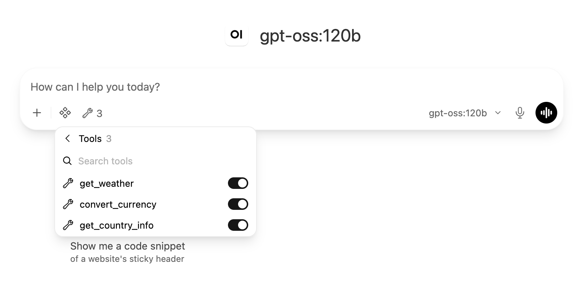
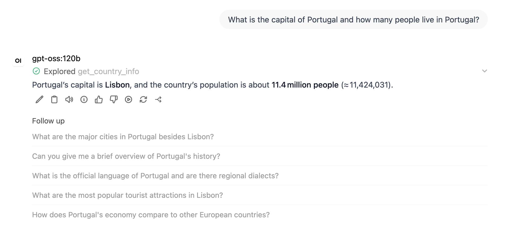

# Adding a tool service: a worked example

This is a transcript-based walkthrough of adding a service with the
`/add-tool-service` skill, and then removing it again. The service built here,
`countries-proxy`, is deliberately **not** part of the repository: the point is the
process, not the result. Everything quoted below is from the real run.

The example wraps [REST Countries](https://restcountries.com) so the model can answer
*"What is the capital of Portugal, and how many people live there?"*. It was chosen
partly because it turned out to need an API key, which exercises the part of the skill
that the keyless `currency-proxy` example does not.

## 0. Before you start

- The skill lives in `.claude/skills/add-tool-service/`. Claude Code discovers it when a
  session starts in this repository; a skill directory created *during* a session is not
  seen until the next restart.
- Work on a clean tree, on a branch. The skill's helper refuses to run if tracked files
  are modified, precisely so that it never applies its edits twice.
- Have the stack running where you deploy. In this run that is `spark01`, the author's
  remote host; on a single machine the deploy step is simply `docker compose up -d --build`.

```bash
git checkout -b try-countries
```

## 1. Invoke the skill

```
/add-tool-service countries look up facts about a country (capital, population,
region, currencies, languages) via REST Countries
```

The first word is the service name; everything after it is a hint for the intake.

## 2. Intake

The skill asks for everything it needs in one round and repeats the summary back for
confirmation. This run's summary, as confirmed:

- **Purpose:** look up reference facts about a country; chat question *"What is the
  capital of Portugal, and how many people live there?"*
- **Upstream:** REST Countries, keyless *(this turned out to be wrong; see step 3)*
- **Tool:** `get_country_info(name: string, exact_match: boolean = false)` on
  `POST /country`, returning name, ISO code, capital, region, subregion, population,
  area, currencies, languages, plus `other_matches` when the name was ambiguous
- **Secret:** none *(also wrong)*
- **Limits the model must know:** reference data, not live; name search matches
  substrings, so *"india"* also matches British Indian Ocean Territory
- **Port:** 5007 (the highest existing `500x` plus one); container `countries-proxy`
- **Deploy** to spark01 and verify now

The intake is where you decide the operation's name and parameters. That name is the
tool name the model sees, so pick it as you would a function name.

## 3. Preflight: the probe that changed the plan

The skill probes a keyless upstream before writing anything. The first probe returned
this instead of a country:

```
301 -> https://files-03.restcountries.com/countries.00/legacy.json
{"success": false, "errors": [{"message": "This API version has been deprecated.
  Please visit https://restcountries.com/docs/countries/legacy-api-deprecation
  to migrate to our new version (v5)."}]}
```

REST Countries v3.1, the version most write-ups describe, is deprecated. The current
v5 API needs an `Authorization: Bearer` key, and its documented demo key returns a
canned example object rather than real data:

```
{"data": {"_demo": {"message": "You just ran a test against the demo key. To get real
  data, sign up for an API key ..."}, "objects": [{"names": {"common": "Canada", ...
```

So the plan changed: a free key from <https://restcountries.com/sign-up>, stored as
`RESTCOUNTRIES_API_KEY` in `.env` on the deployment host — never in the repository.
The canned demo object was still useful: it shows the exact field shapes
(`capitals[].name`, `area.kilometers`, `currencies[]` as `{code, name, symbol}`), which
the service code needs.

This is the kind of thing the preflight exists for. Had the service been written from
the old documentation, every call would have returned a deprecation notice, and the
model would simply have said it could not look up countries.

The collision check then confirmed the proposal was free:

```
  [ ok ] container name 'countries-proxy' is free
  [ ok ] directory 'countries-proxy/' does not exist yet
  [ ok ] connection url for countries-proxy not yet stored
  [ ok ] port 5007 is free
  [ ok ] operationId 'get_country_info' is snake_case
  [ ok ] operationId 'get_country_info' is free
```

## 4. Generate

### 4.1 The service

`countries-proxy/countries_service.py` starts from the skill's template. The parts
worth reading are the two descriptions in the OpenAPI document, because they have
different audiences.

The **operation description** is what the model reads to decide whether and how to call
the tool. It states purpose, parameter hints, and the practical limits:

> Look up reference facts about one country by name: capital, region, subregion,
> population, area in square kilometres, currencies and languages. Search uses the
> English common or official name and matches substrings, so 'india' also matches
> British Indian Ocean Territory; the response's other_matches lists the alternatives
> when a name was ambiguous, and exact_match=true restricts the lookup to a country
> whose name equals the query. This is reference data, not live statistics: population
> is a periodically synced estimate.

The **`info.description`** carries the data attribution and the note that a key is
required. The model never reads it; the admin UI and anyone inspecting the spec do.

The service maps upstream failures to sentences the model can act on: a rejected key
becomes *"REST Countries rejected the API key (RESTCOUNTRIES_API_KEY)"*, no match
becomes *"no country matches 'X'; use the English common or official name"*.

### 4.2 Wiring, done by the helper

```bash
python3 .claude/skills/add-tool-service/scripts/add_tool_service.py add \
    --name countries --port 5007 --operation-id get_country_info \
    --info-description "Look up facts about a country" \
    --secret RESTCOUNTRIES_API_KEY \
    --secret-comment "REST Countries API key, free sign-up at https://restcountries.com/sign-up"
```

It edits three files and nothing else. In `docker-compose.yml`, the existing
connection entries are untouched except that the closing `]` of the array becomes a
`,`, then the new entry follows:

```diff
-        "description": "Convert amounts between currencies at ECB reference rates"}}]
+        "description": "Convert amounts between currencies at ECB reference rates"}},
+        {"url": "http://countries-proxy:5007", "path": "openapi.json",
+        "type": "openapi", "auth_type": "bearer", "headers": null, "key": "",
+        ...
```

Note the url: the service **root**, not `/country`. Open WebUI appends `openapi.json`
to fetch the spec and `/country` to make calls; a url ending in the endpoint resolves
the spec to `/country/openapi.json` and the tool silently never loads.

The new service block carries the secret from `.env`:

```diff
+  countries-proxy:
+    build: ./countries-proxy
+    container_name: countries-proxy
+    restart: unless-stopped
+    environment:
+      - RESTCOUNTRIES_API_KEY=${RESTCOUNTRIES_API_KEY}   # from .env: REST Countries API key, ...
+    expose:
+      - "5007"
```

`.env.example` gains the variable with its comment, and `scripts/health-check.sh`'s
container list gains `countries-proxy`. The helper re-parses the connections JSON it
wrote before writing anything, and refuses if the round trip differs: a broken value
here makes Open WebUI log one line and register no tools at all.

### 4.3 Health check and README

Everything the helper does not do needs judgement and is done by hand from the skill's
templates: a `check_countries_proxy` function (credentials, spec, stored connection,
one live lookup of Portugal asserting the capital), one call line in the main flow,
the tool's name in the `check_resolved` call, and README updates (diagram, key
section, wiring table, attribution, troubleshooting).

## 5. Checklist and local validation

Before deploying, the skill walks `references/pitfalls.md`. This run's mechanical
items:

```
  [ ok ] SPDX headers on both new files
  [ ok ] port 5007 used consistently (7 occurrences across service/Dockerfile/compose/health-check)
  [ ok ] connection url is the service root
  [ ok ] open-webui depends_on includes countries-proxy
  [ ok ] restart: unless-stopped
  [ ok ] secret comes from .env and is listed empty in .env.example
  [ ok ] no key value in any tracked file
  [ ok ] weather-proxy/ and currency-proxy/ untouched
  [ ok ] existing connection entries unchanged except ] -> ,
  [ ok ] no $ref in spec
  [ ok ] operationId get_country_info, snake_case
```

and `docker compose config` renders three connections:

```
rendered connections: 3 ['http://weather-proxy:5005', 'http://currency-proxy:5006', 'http://countries-proxy:5007']
```

## 6. Deploy and verify

The key goes into `.env` on the deployment host by hand — it is the only file that is
neither in the repository nor generated:

```
RESTCOUNTRIES_API_KEY=rc_live_...
```

Then sync, build, and watch one line in particular:

```bash
rsync -a --exclude .git --exclude .env ./ spark01:~/git/open-webui-service-weather/
ssh spark01 'cd ~/git/open-webui-service-weather && docker compose up -d --build'
ssh spark01 'docker logs open-webui 2>&1 | grep "tool server" | tail -1'
```

```
Initialized 2 tool server(s)
```

Two, not three. This is the single most confusing behaviour in the whole setup and it
is expected: `TOOL_SERVER_CONNECTIONS` only seeds an *empty* database. This install
already had its connections stored, so the stored list wins and the new entry in the
environment is ignored. `sync-tool-servers.sh` appends the missing entry to the
database and restarts Open WebUI:

```
$ ./scripts/sync-tool-servers.sh
stored connections: 2
  + http://countries-proxy:5007  (get_country_info)
written: 3 connection(s) now stored
restarting open-webui so it re-reads the stored connections...
open-webui: Initialized 3 tool server(s)
```

A fresh volume would have needed none of this. Now the health check covers all three
services, fourteen sections in all; the new ones:

```
10. countries-proxy: REST Countries credentials
  [ ok ] RESTCOUNTRIES_API_KEY is set in countries-proxy (40 characters)
11. countries-proxy: OpenAPI spec
  [ ok ] countries-proxy serves /openapi.json, operationId = get_country_info
12. countries-proxy: stored connection
  [ ok ] connection stored for http://countries-proxy:5007
13. countries-proxy: live lookup
  [ ok ] live call: Portugal -> Portugal, capital Lisbon, population 11424031
14. Open WebUI resolves the tools
  [ ok ] tools available to the model: get_weather,convert_currency,get_country_info
```

Finally the model itself, with every tool on offer so that choosing the right one is
part of the test:

```
$ ./scripts/e2e-tool-call.sh --expect get_country_info \
    --question "What is the capital of Portugal, and how many people live there?"
tools offered: get_weather, convert_currency, get_country_info
round 1: get_country_info {"name": "Portugal", "exact_match": true}
   -> {"area_km2": 92090, "capital": "Lisbon", "currencies": [{"code": "EUR", ...
round 2: model answered

The capital of Portugal is **Lisbon**, and its population is about **11.4 million people**.
```

Two details worth noticing. The model set `exact_match: true` unprompted — the
operation description told it what the parameter is for, and it used it. And a
currency question asked right afterwards still went to `convert_currency`: adding a
third tool did not confuse the choice between the other two.

## 7. The chat window

Registration makes the tool *available*; it does not switch it on. In a chat, click the
wrench icon under the message box. All three tools are listed and, on a fresh
conversation, all three are off:



With `get_country_info` on, the Portugal question gets a grounded answer, and Open
WebUI shows which tool it used:



That *Explored get_country_info* line is the UI-level proof that the scripts cannot
give: the model was offered the tool, chose it, and answered from its result.

## 8. Removing it again

The service was an exercise, so it goes away. Removal has three parts, and the middle
one is the one people forget.

**1. Remove the stored connection.** Deleting the service from the compose file does
not touch the database; Open WebUI would keep listing a dead server and logging a
failed fetch for it at every start. `sync-tool-servers.sh --remove` is the inverse of
the append:

```
$ ./scripts/sync-tool-servers.sh --remove http://countries-proxy:5007
stored connections: 3
  - http://countries-proxy:5007
written: 2 connection(s) now stored
restarting open-webui so it re-reads the stored connections...
open-webui: Initialized 2 tool server(s)
```

Do this *before* reverting the files, because the reverted script may not have the
option. Tool ids are positional, so removing an entry shifts the ids of any entry after
it; removing the last one, as here, shifts nothing.

**2. Revert the repository.** On the development machine the trial was never committed,
so it is a checkout and a delete:

```bash
git checkout -- docker-compose.yml scripts/health-check.sh README.md .env.example
rm -rf countries-proxy
```

On the deployment host, restore the tree and recreate the stack from the restored
compose file; `--remove-orphans` takes the container away, and the built image can go
too:

```bash
git checkout -- . && git clean -fd -- countries-proxy
docker compose up -d --remove-orphans
docker image rm open-webui-service-weather-countries-proxy
```

**3. Verify.** The health check is back to ten sections, and the resolved-tools line
names exactly the two remaining tools:

```
Initialized 2 tool server(s)
10. Open WebUI resolves the tools
  [ ok ] tools available to the model: get_weather,convert_currency
all checks passed
```

The key stays in `.env` on the host until you remove it yourself; nothing in the
repository ever held it.

## What the run taught

- **Probe first.** The API a tutorial describes may not be the API that answers today.
  Five minutes of `curl` turned a keyless plan into a keyed one before any code existed.
- **Two audiences, two descriptions.** The model reads the operation description and
  acted on it (`exact_match: true`, unprompted). Attribution goes in `info`.
- **The database wins.** `Initialized 2` after adding a third service is not a bug. On
  an existing install the connection must be written to the database, and removed from
  it again on the way out.
- **A registered tool is an off tool.** The wrench toggle is per conversation.
- **Leave the host clean.** Files on the deployment host should always match a commit,
  so that the next `git pull` is uneventful.
